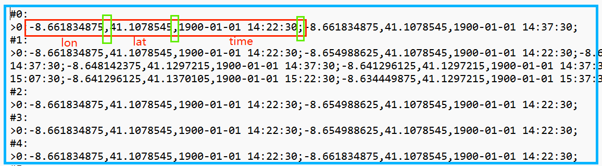

# Directory structure
***

### The code structure is as follows:
***

- parameters.py:Integration of the parameters used.  
- Processing.py:Pre-processing of data.
- TPM.py:Main function.
- removeTime.py:Keep location information, remove time information.
- tran.py:Convert grid indexes to latitude, longitude and time information.

### Document catalog description
***
- parameters:
    - boundary.txt:Latitude and longitude range of the trajectory.  
    - cellSize.txt:Divide the size of the grid.  
    - neighborFile.txt:Record neighboring grids for each grid.
    - time.txt:Time horizon of the trajectory.
    - timeStep.txt：The duration of the interval(minutes).
- raw_data.  
- output.

# How to run
***
#### Python    
The version of python used in this code is `python == 3.8`.  
#### Prepare data    
Firstly, put `Original.txt` in the `data/raw_data/`. The data format is shown below:  
  
  

In this code, we provided 5000 trajectorys in `data/raw_data/Original.txt`
  

#### Run the code
Firstly, modify parameters `data/parameters/` in the following format.  
Separate by spaces.   

- boundary.txt: `lon_left lon_right lat_bottom lat_top`  
- cellSize.txt: `cellH cellW`  
- time.txt: `startTime endTime`
- timeStep.txt: `The duration of the interval(minutes)`  

Secondly, modify parameters in code.  

- In `TPM.py`   
    - In  `main`: `eps`，`name`, `times`

Thirdly, run `TPM.py`.